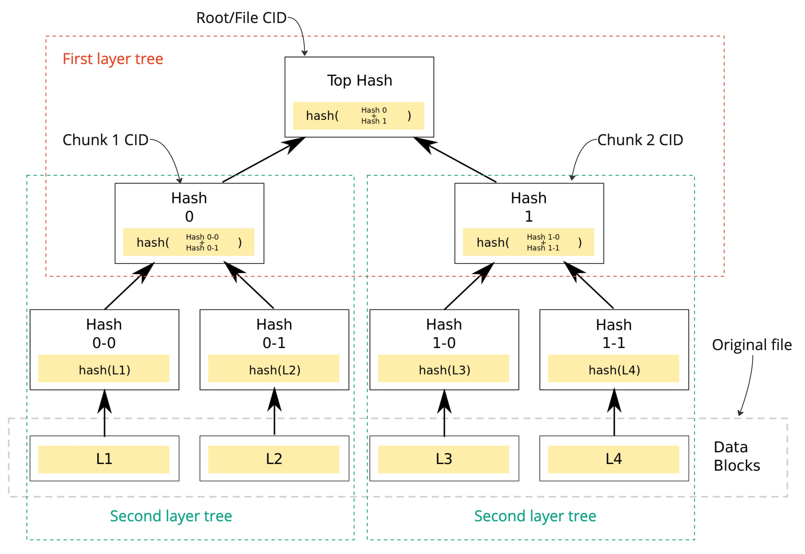

# Verified range request

## Context

Most of the decentralised storages are content addressable. So the content identifier is based on the content hash. This technique allows client to authenticate the content after the downloading by verifying requested hash and hash of the received content.

Unfortunately, such approach limits developers in building modern decentralised applications that should be secure and efficient (e.g. because client have to serve unverified content or download whole file before serving it). The problem becomes more challenging if we would think about large files (e.g. 10s of GBs for 4K videos).

### Use cases

- Video and audio streaming
    - Adopt range (like http range) according to client’s state and network connection
    - Seek at certain position (e.g. jump to the middle of the content)
- Large files
    - Ability to start from certain offset/position so download operations can be paused (or failed) and resumed.
    - Random access that support parallel access (so download operation can be distributed).
- Common (for all use cases above)
    - Fail fast approach. Start read the data, and verify it on the fly. Once there is a tampered data, stop consuming. So any portion of data consumed is authenticated.
    - Content authentication/verification is efficient in terms of storage, bandwidth and latency overhead.

### Considerations

#### Bao

[Bao](https://github.com/oconnor663/bao) is cryptography software that is based on hash tree based hashing algorithm. Bao encodes a file in a such way, that it can be streamed in a secure way and client can authenticate the content on the fly against file hash he knows. The hash tree that has been used to build root hash (file identifier) is directly encoded into the file.

Bao is a great software, but it doesn't support seeking and issue becomes more serious in case of large files that can be distributed across set of nodes.

#### Custom encoding

The file can be split into smaller chunks where each chunk can be presented as a separate piece. Additionally, root (or parent) piece can be created that stores a list of chunk hashes. So when client wants to download particular chunk, he fetches root piece, verifies it and then download chunk he is interested in.

This approach has next issues:
1. Chunks have fixed sizes. So use cases like video streaming becomes less flexible.
2. Such custom encoding produces custom hash that isn't equal to a hash of original file.

## Decision

Range requests are useful for clients like media players that support random access, data tools that know they need only part of a large file, and download managers that let the user pause and resume the download.

Supporting range requests that are verifiable allows to cover most of the use cases and be efficient enough to provide quality of service that users are used to these days.

### HTCA (hash-tree-based content authentication)

One of the most commonly used techniques is to use merkle tree to authenticate some portion of data against single identifier (root hash).

The idea is to split file into blocks, calculate hash per block and insert block hashes into the leafs and accomplish tree by building parent nodes level by level where parent node hash is a combined hash of its children.

Such hash-based structure allows us to request sequence of blocks (range request) and build a merkle proof (also known as a merkle path) to proof that that sequence of blocks belongs to file client requested for. 

### 2-layered hash tree

The large files (100s of GBs or even TBs) can also follow the same approach but the issue here is that now always it's possible to allocate such big files (and their hash trees) on a single machine. Also, large file content should be somehow spread across the network and there is a need to have some piece discovery mechanism.

The proposal is to build 2-layered hash tree where first layer is present by single hash tree (piece) where root hash is a hash of original file and second layer is present by set of hash trees (pieces) of file chunks. 

The first layer can be served as a piece discovery mechanism so in order to find a file chunk client is interested in, we use this hash tree where leafs are hashes of chunk pieces. 

Using both layers, the minimal data unit that can be retrieved by client and verified is a block (leaf of a second layer hash tree) and having hash trees of both layers, compact merkle proof can be built in an efficient way.

### Content identifier

Ideally, the original file hash, that can be calculated by content owner locally on his machine should remain the same after the uploading it to the network. Otherwise, you force client to trust you and your custom encoding/hashing algorithm.

As for me, the most interesting part of this proposal is to integrate HTCA (2 layered hash trees) natively with [Blake3](https://github.com/BLAKE3-team/BLAKE3-specs/blob/master/blake3.pdf).

So, the blake3 hash of original file that any client can calculate using blake3 tools or any other software is identical to a file identifier in our system.

## References

1. [Blake3](https://github.com/BLAKE3-team/BLAKE3-specs/blob/master/blake3.pdf)
2. [Bao](https://github.com/oconnor663/bao)
3. [How to sign digital streams](https://www.sciencedirect.com/science/article/pii/S089054010092916X/pdf)
4. [BitTorent BEP 30](http://bittorrent.org/beps/bep_0030.html)
5. [Tree Hash Exchange (THEX)](https://adc.sourceforge.io/draft-jchapweske-thex-02.html)
